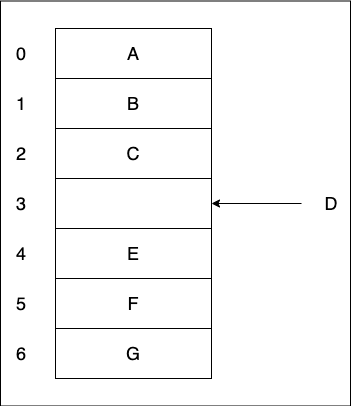
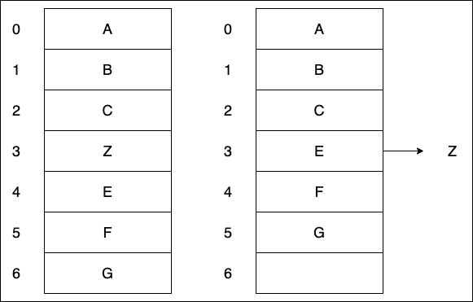

# 第一周学习总结

## 一、精通一个领域

- Chunk it up 切碎知识点
- Deliberate Oracticing 刻意练习
- Feedback 反馈

## 二、时间复杂度的表示

> 使用 Big O notation 来表示时间复杂度  
> 时间复杂度的判定以最高时间复杂度为该段程序的时间复杂度  
> 分析时间复杂度主要看一段程序执行了多少次

### 三、常见时间复杂度

- O(1) Constant Complexity 常数复杂度
- O(log n) Logarithmic Complexity 对数复杂度
- O(n) Linear Complexity 线性时间复杂度
- O(n^2) N square Complexity 平方
- O(n^3) N cubic Complexity 立方
- O(2^n) Exponential Growth 指数
- O(n!) Factorial 阶乘

## 四、空间复杂度

> 空间复杂度和时间复杂度的情况类似

- 数组的长度
- 递归的深度

如果在运算时，开辟了一个数组空间，数组的长度 n，基本上就是这段程序的空间复杂度

递归的深度是空间复杂度的最大值，如果在递归里面开辟的新的数组空间，两者的最大值就是该段程序的空间复杂度。

## 五、斐波那契数列

> 求 Fibonacci(斐波拉契数列)的第 n 项

- 通项公式：Fn = F(n - 1) + F(n - 2)
- 递归（O(k^n)）

```javascript
function fib(n) {
  if (n < 2) return n;
  return fib(n - 1) + fib(n - 2);
}
```

> 递归树

.png>)

## 六、数组

> 创建一个数组的话，实际上计算机通过内存管理器，开辟了一段连续的地址，每一个地址，都可以通过内存管理器进行访问。

### 6.1 数组添加元素



### 6.2 数组删除元素



## 七、链表

> 链表是一种动态的数据结构，不同于数组的是，链表分配内存空间的灵活性，它不会像数组一样被分配一块连续的内存。

- 一般的语言实现链表都需要指针来实现
- 而 js 的引用类型本来就是按值引用的
- 变量中保存的实质上是一个指向其对应对象的一个指针

### 7.1 JavaScript 实现链表

```javascript
class Node {
  constructor(val) {
    this.val = val;
    this.next = null;
  }
}
class LinkedList {
  //传入和返回都是Node类型，第一个元素下标0
  constructor(node) {
    this.head = node;
    this.length = 1;
  }
  get isEmpty() {
    return !this.length;
  }
  append(node) {
    var lastNode = this.findAsIndex(this.length - 1);
    lastNode.next = node;
    this.length++;
  }
  insert(index, node) {
    //在哪个元素之前插入
    var targetNode = this.findAsIndex(index - 1);
    node.next = targetNode.next;
    targetNode.next = node;
  }
  remove(index) {
    var preNode = this.findAsIndex(index - 1);
    var nextNode = this.findAsIndex(index + 1);
    preNode.next = nextNode;
  }
  findAsIndex(index) {
    if (index > this.length) {
      console.log('越界');
      return;
    }
    if (index === 0) {
      return this.head;
    }
    var curNode = this.head;
    while (index && curNode) {
      index--;
      curNode = curNode.next;
    }
    return curNode;
  }
  toString() {
    var curNode = this.head;
    var arr = [];
    var i = 0;
    while (curNode) {
      arr[i++] = curNode.val;
      curNode = curNode.next;
    }
    return arr.toString();
  }
}

let list = new LinkedList(new Node('a'));
list.append(new Node('b'));
list.append(new Node('d'));
list.insert(2, new Node('c'));
list.remove(1);
console.log(list.toString());
```

## 八、跳表

- 由很多层结构组成
- 每一层都是一个有序的链表
- 最底层(第 0 层)的链表包含所有元素
- 如果一个元素出现在第 i 层中，则它在第 0 到第 i-1 层也都会出现
- 跳表是一种随机化的数据结构（通过掷硬币的过程可以看出）

```javascript
//定义跳表结点
function Node(key, value) {
  this.key = key;
  this.value = value; //next指针数组 //此元素跨越多少层，next数组就含有多少指向下一结点的指针
  this.next = [];
}

//跳表
class SkipList {
  constructor() {
    //头结点不存值
    this.head = new Node(undefined, undefined); //初始时，跳表层数为0
    this.level = 0; //初始时，跳表含有0个元素
    this.size = 0;
  } //查找操作，通过key获取值

  get(key) {
    let p = this.head;
    for (let i = this.level - 1; i >= 0; i--) {
      while (p.next[i] && p.next[i].key <= key) p = p.next[i];
      if (p.key == key) return p.value;
    }
    return undefined;
  } //插入操作，插入一个键值对

  set(key, value) {
    let p = this.head; //update用于记录每层拐点
    let update = new Array(this.level);
    for (let i = this.level - 1; i >= 0; i--) {
      while (p.next[i] && p.next[i].key <= key) p = p.next[i];
      if (p.key == key) {
        p.value = value;
        return this;
      }
      update[i] = p;
    }
    let newNode = new Node(key, value); //k代表新插入结点跨越层数
    let k = 1; //模拟抛硬币过程
    while (Math.random() < 0.5) k++;

    if (k > this.level) {
      for (let i = this.level; i < k; i++) {
        newNode.next[i] = null;
        this.head.next[i] = newNode;
      }
      this.level = k;
      k = update.length;
    }

    for (let i = k - 1; i >= 0; i--) {
      newNode.next[i] = update[i].next[i];
      update[i].next[i] = newNode;
    }

    this.size++;
    return this;
  } //删除一个键值对

  delete(key) {
    let p = this.head; //update用于记录每层拐点
    let update = new Array(this.level);
    for (let i = this.level - 1; i >= 0; i--) {
      while (p.next[i] && p.next[i].key < key) p = p.next[i];
      update[i] = p;
    }
    if (p.next[0] && p.next[0].key == key) {
      let deleteNode = p.next[0];
      for (let i = deleteNode.next.length - 1; i >= 0; i--) {
        update[i].next[i] = deleteNode.next[i];
        deleteNode.next[i] = null;
        if (this.head.next[i] == null) {
          this.level--;
        }
      }
      this.head.next.length = this.level;
      this.size--;
      return true;
    }
    return false;
  }
}
```

## 九、栈

> 栈是一种遵从后进先出（ `LIFO——Last In First Out` ）原则的有序集合。新增加的或删除的元素都保存在栈的同一端，称作栈顶，另外的一端就是栈底。在栈里面，新元素都靠近栈顶，旧元素都接近栈底。

### 9.1 JavaScript 实现栈

```javascript
function Stack() {
  let items = [];
  // 向栈添加新元素
  this.push = function (element) {
    items.push(element);
  };

  // 从栈内弹出一个元素
  this.pop = function () {
    return items.pop();
  };

  // 返回栈顶的元素
  this.peek = function () {
    return items[items.length - 1];
  };

  // 判断栈是否为空
  this.isEmpty = function () {
    return items.length === 0;
  };

  // 返回栈的长度
  this.size = function () {
    return items.length;
  };

  // 清空栈
  this.clear = function () {
    items = [];
  };

  // 打印栈内的所有元素
  this.print = function () {
    console.log(items.toString());
  };
}
```

## 十、队列

> 队列与栈不同，它遵从先进先出（`FIFO——First In First Out`）原则，新添加的元素排在队列的尾部，元素只能从队列头部移除。

### 10.1 JavaScript 实现队列

```javascript
function Queue() {
  let items = [];

  // 向队列添加元素（一个或多个）
  this.enqueue = function (element) {
    if (element instanceof Array) items = items.concat(element);
    else items.push(element);
  };

  // 从队列移除元素
  this.dequeue = function () {
    return items.shift();
  };

  // 返回队列中的第一个元素
  this.front = function () {
    return items[0];
  };

  // 判断队列是否为空
  this.isEmpty = function () {
    return items.length === 0;
  };

  // 返回队列的长度
  this.size = function () {
    return items.length;
  };

  // 清空队列
  this.clear = function () {
    items = [];
  };

  // 打印队列内的所有元素
  this.print = function () {
    console.log(items.toString());
  };
}
```

### 双端队列

- 简单理解：两端可以进出的
- 插入和删除都是 O(1)操作
- QueueDeque - double ended queue

### 优先队列

- 插入操作：O(1)
- 取出操作：O(logN) - 按照元素的优先级取出
- 底层具体实现的数据结构较为多样和复杂：heap、bst(二叉搜索树)、treap
